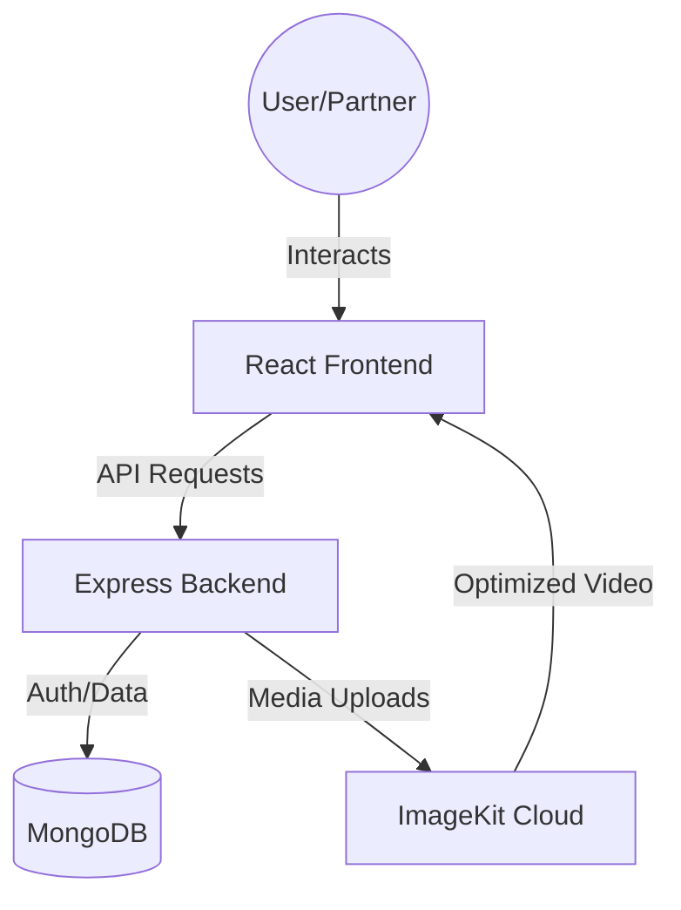

# FoodReelz - The TikTok for Food Discovery

FoodReelz is a revolutionary MERN stack platform that transforms the traditional food-ordering experience into an immersive, video-driven discovery journey. Instead of scrolling through static menus, users explore a vertical feed of engaging short videos (Reels) posted by food partners, allowing them to see exactly what they're ordering before they click.

## 🚀 Key Features

- **Dual-Role Ecosystem**: Tailored experiences for both **Customers** (Discovery & Ordering) and **Food Partners** (Content Creation & Management).
- **Immersive Food Reels**: A vertical, auto-playing video feed featuring real-time "Like" and "Save" interactions.
- **One-Click Ordering**: Seamless transition from video discovery to food acquisition.
- **Professional Partner Dashboard**: Tools for restaurants to upload Reels, manage food listings, and track engagement.
- **Optimized Media Delivery**: High-performance video streaming and transformation powered by **ImageKit**.
- **Secure Authentication**: Robust JWT-based authentication with separate flows for users and partners.
- **Responsive Design**: Mobile-first approach ensuring a premium experience across all devices.

---

## 💡 The "Why" Behind FoodReelz

In a world of static menus, **FoodReelz** was born to bridge the gap between visual craving and instant gratification. By leveraging the familiar "Reels" format, we reduce the cognitive load of choosing food, turning a chore into a delightful discovery process.

---

## 🏗️ System Design & Architecture

FoodReelz follows a decoupled Client-Server architecture designed for scalability and rapid content delivery.

### Architecture Overview
- **Frontend**: Built with **React** and **Vite** for a blazing-fast, responsive UI. It utilizes **Vanilla CSS** for premium, custom-tailored aesthetics without the bloat of heavy frameworks.
- **Backend**: A **Node.js/Express** REST API that handles business logic, authentication, and database orchestration.
- **Database**: **MongoDB** serves as the primary data store, using **Mongoose** for schema definitions and data modeling.
- **Media Pipeline**: Videos are processed via **Multer** and offloaded to **ImageKit** for optimized cloud storage and CDN delivery.

### Data Flow Diagram


---

## 📂 Code Structure

### Backend (`/backend`)
```text
src/
├── controllers/    # Business logic (Auth, Food management, Engagement)
├── db/             # Database connection and configuration
├── middlewares/    # Custom middlewares (Auth guards, Validation, Rate limiting)
├── models/         # Mongoose schemas (User, FoodPartner, Food, Like, Save)
├── routes/         # Express router mappings
├── services/       # External service integrations (ImageKit)
└── app.js          # Express app configuration & middleware pipeline
```

### Frontend (`/frontend`)
```text
src/
├── api/            # API service layers
├── components/     # Reusable UI components (ReelVideo, Layouts)
├── hooks/          # Custom React hooks
├── pages/          # Full page views (Dashboard, Login, Register)
├── routes/         # Client-side routing logic
└── utils/          # Helper functions and constants
```

---

## 🛠️ Tech Stack

- **Frontend**:   
- **Backend**:  
- **Database**: 
- **Auth**: 
- **Cloud**: 

---

## 📡 API Documentation

### 1. Authentication (`/api/auth`)

| Endpoint | Method | Role | Description |
| :--- | :--- | :--- | :--- |
| `/register` | POST | Customer | Register a new user account |
| `/login` | POST | Customer | Login and receive session cookie |
| `/logout` | GET | Customer | Clear session and logout |
| `/food-partner/register` | POST | Partner | Register a new food partner |
| `/food-partner/login` | POST | Partner | Partner login flow |
| `/food-partner/:id` | GET | Any | Get public profile of a partner |

### 2. Food Management (`/api/food`)

| Endpoint | Method | Auth | Description |
| :--- | :--- | :--- | :--- |
| `/` | GET | Optional | Fetch reels feed (personalized if logged in) |
| `/` | POST | Partner | Upload new food reel (Multipart/form-data) |
| `/partner/:id` | GET | Optional | Fetch reels from a specific partner |
| `/like` | POST | User | Toggle like status on a reel |
| `/save` | POST | User | Toggle save/bookmark status on a reel |
| `/liked` | GET | User | Fetch a list of user's liked items |
| `/:id/likes` | GET | Public | Get count and users who liked a reel |

---

## ⚙️ Development Setup

1. **Prerequisites**: Node.js (v18+), MongoDB, ImageKit account.
2. **Setup**:
   - Clone repo and run `npm install` in both `backend/` and `frontend/`.
   - Configure `.env` in `backend/` (see `.env.example`).
3. **Run**:
   - Backend: `npm run dev` (starts on port 5000)
   - Frontend: `npm run dev` (starts on port 5173)

---

## 🧠 Key Challenges & Solutions

### 1. High-Performance Video Streaming
- **Challenge**: Standard HTML5 video tags caused significant lag when multiple reels were loaded.
- **Solution**: Implemented Intersection Observer API to lazy-load and auto-play videos only when they are in the viewport, significantly reducing memory overhead.

### 2. Complex Authentication Logic
- **Challenge**: Managing distinct state and permissions for two different user roles (Customer vs. Partner).
- **Solution**: Designed a unified middleware architecture with role-based access control (RBAC) to ensure secure and isolated data access.

### 3. Media Transformation
- **Challenge**: Users upload videos in various formats and aspect ratios.
- **Solution**: Integrated ImageKit's real-time transformation API to ensure all reels are served in a consistent vertical format with optimized bitrates.

---

## 🗺️ Roadmap
- [ ] **AI-Powered Personalization**: Implementing a recommendation engine based on user interaction.
- [ ] **Live Order Tracking**: Integration with third-party logistics APIs.
- [ ] **Social Sharing**: Deep-linking reels to Instagram/TikTok stories.

---

## 📜 License
This project is developed for demonstration and educational purposes. All rights reserved.
